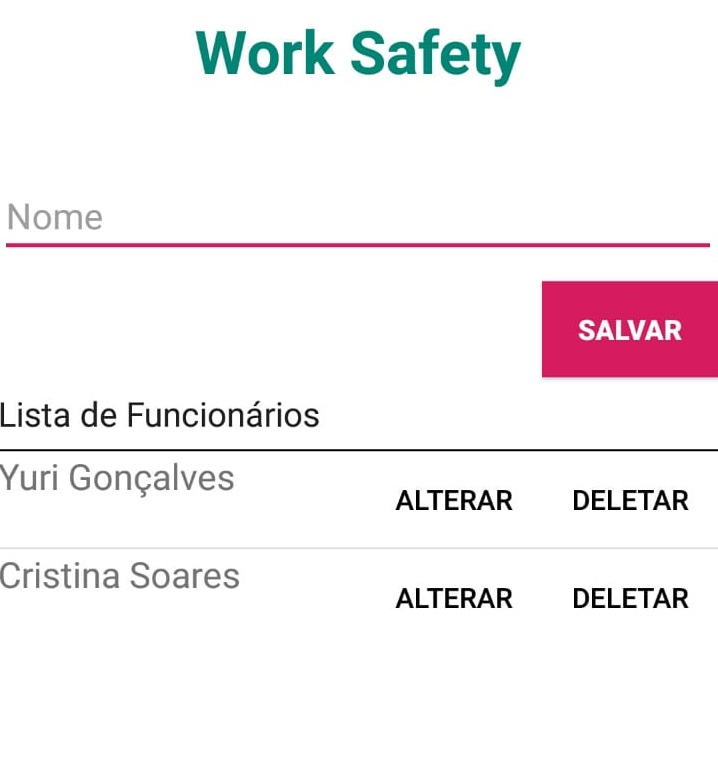

## Work Safety - Sistema web e mobile com o Firebase
Trabalho prático realizado para a disciplina de Sistemas Distribuídos do curso de Pós Graduação em Desenvolvimento Web e Mobile na FATEC.

#### Introdução

Um sistema distribuído desenvolvido em Web e Mobile, com a finalidade de listar os funcionarios da empresa X, em ambas plataformas simultaneamente, utilizando a IDE Android Studio (Mobile) e a IDE Visual Code (Web) no seu desenvolvimento, tendo como integrante principal o Firebase com a sua funcionalidade Realtime Database para o armazenamento em nuvem e instantaneo.

**Tecnologias:**

O desenvolvimento deste projeto utilizou como base, o estudo de algumas tecnologias que auxiliaram no processo de desenvolvimento, sendo elas:

* Java;
* JavaScript;
* HTML;
* CSS;
* Firebase - Realtime Database;
* Bootstrap;
* Font Awesome.

#### Firebase Realtime Database

O Firebase Realtime Database e um banco de dados hospedado na nuvem. Os dados sao armazenados como JSON e sincronizados em tempo real com todos os clientes conectados.

Firebase foi escolhido pelo fato de possuir uma facilidade na sua utilizac¸ao de hospedagem na nuvem e pelo fato de ser sincronizados em tempo real com todos os clientes conectados. Facilidade primordial para o desenvolvimento de um sistema distribuído.

**Requisitos funcionais:**

* Adicionar Funcionário;
* Editar Funcionário;
* Excluir Funcionário;
* Listar Funcionários.

**Requisitos não funcionais:**

* Integrar o sistema com Firebase;
* Ter acesso à internet;
* Dados simultâneos em ambas plataformas.

#### Work Safety

Nesta seção são apresentadas as telas do sistema para um melhor entendimento de suas funcionalidades.

   
  <b>Figura 1. Tela principal do sistema Web</b>
   
   

   
  <b>Figura 2. Tela principal do sistema Mobile</b>
   
   

   
  <b>Figura 3. Dados inseridos no Realtime Database</b>
   
   

